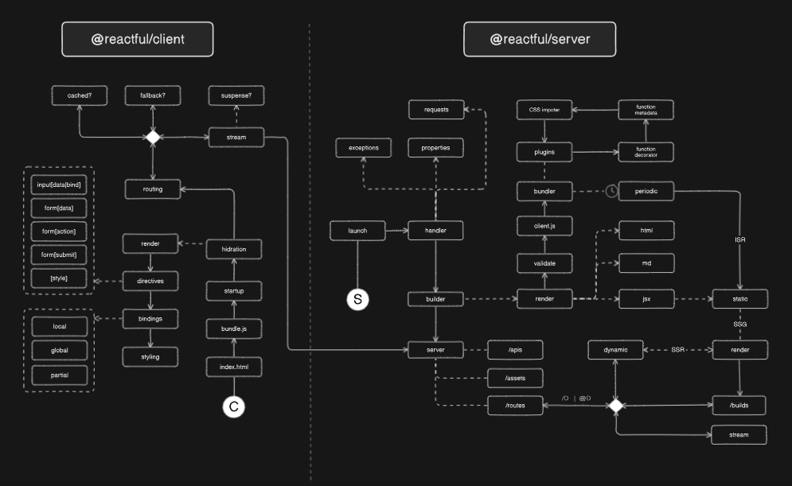

# @reactful

> **WARNING! This project is not fully open source.**

<p center>Reactful solves stateful complexity in React with by stateful objects with function decorators and props handler; with support to server-side rendering with easy SEO and comprehensive routing.</p>

## Overview

Stateful objects evokes the component render when object fields is changed, being managed by a performatic batching algorithm to prevents multiple rendering.

```ts
import * from '@c0d3x/reactful'

const store = useStore({ hello: world })
store.hello = 'john' // setState behavior
```

Reactive objects embbeds state handling hooks has compreehensive states (local, global, partial), performatic algorithm (debounce algorithm) with 

Data binding is improved by `[data]` and `[bind]` directives.

```ts
@client(true, store)
const Hello = props => <>
   <h1>Hello { store.hello }</h1>
   <input data={store} bind='hello' />
</>
```


## Features

Reactful framework introduces those new features that enable its stateful approach and bring another React improvements, like CSS scoping. TODO: complete

- **function decorators**: enable decorators with functions by transpiler.
  
- **reactive objects**: self-rendering states for hookless stateful handing.

- **injectable props**: Angular-like attribute directive for props transformation.
  
- **modular CSS**: fixes the global CSS leakins during modular CSS imports.

More details in site [documentation](https://jsenaribeiro.github.io/documentation).

## Architecture 




## Modules

|                      |                                                        |
| -------------------: | ------------------------------------------------------ |
| **@reactful/kernel** | Core decorators, directives, constants, variables, etc |
| **@reactful/server** | Server transpilers, renders, routing, etc              |
| **@c0d3x/reacful** | Client data binding, routing and renderers             |
| **@reactful/create** | CLI tool to create an scaffold project with Reactful   |
| **@reactful/script** | Bun TypeScripts for utilities in package.json          |


