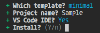

<script src='../@assets/js/index.js'></script>
<style>@import url(creation.css);</style> 

# Creation

> HTML | CSS | TypeScript | Bun

New project with the template creator using `@c0d3x/reactful/create@latest`. 

```ps
$ bunx @c0d3x/reactful/create
```

The create CLI has some questions as below.

<aside id='cli' cols='4:5'>



* **template**: empty | minimal | sampling
* **project name**: it will create the folder project
* **vs code**: if yes, it will create debug settings

</aside>


Reactful is debug-ready configuration for Vs Code and with package.json scripts:


<section style='margin-left: 30px; zoom: 95%'>

| `bun run start` | `bun run debug` |  `bun run build`  | `bun run clear`    |
| --------------: | :-------------: | :---------------: | :----------------- |
|   build and run | vscode debugger | build the project | clear build folder |

</section>

The minimal templates starts with index.html wrapper and index.ts boostrap.

<aside cols='2'>

```typescript
// index.ts
import Reactful 
from '@c0d3x/reactful'

await Reactful.launch().server()  
```

```ts
// routes/index.ts
export default props => <>
   <h1>Welcome to Reactful</h1>
   <p>Hello World!</p>
</>
```

</aside>