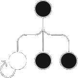
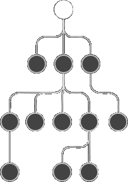
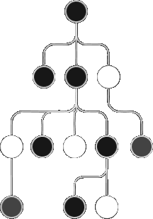

<style>@import url(stateful.css);</style> 

# Stateful

> reactive object • stateful props • modular state • global state • self-rendering state • dependency injection

## Reactive objects 

Reactive object is a self-rendering state that encapsulates the state handling boilerplate code. When a reactive objct is changed, it call the render of its hosted component. 

| | | |
|-:|-|-|
| local | props | all props is meade reactive | 
| global | store + DI | object injected component root |
| partial | stores + decorator  | shared states between components |


## Local state props 

Props and states are merged in reactive object for imediate local state handling.

<aside id='local-state' diagram cols='1:auto'>

```tsx
const Hello = props => <>
    Hello { props.name } !
   <input value={props.name} 
         onChange={e => props.name = e.target.value} />
</>
```



</aside>

## Injectable Global state

Store is an injectable global state, following the Single Source of Truth (SSoT) pattern.

<aside id='global-state' diagram cols='1:auto'>

```tsx
// injecting a global state in launch function
await launch({ store:{ name: 'world' }}).server()

// resolving in 2nd arguments as feeds.store
const Hello = (props, feeds) => <>
   Hello { feeds.store.name || 'World' } !
   <input value={feeds.store.name} 
          onChange={e => props.name = e.target.value} />
</>
```



</aside>

## Modular Partial states

Partial states are modular state as multiple store, with partial component tree render, instead of a full rendering of a global state. It is an specialized alterantive to deal large monolith component tree.

<aside id='partial-state' diagram cols='1:auto'>

```ts
const person = useStore({ guid: 0, name: 'john' })

@client(true, person)
const Hello = props => <> 
   Hello { person.name } !
   <input value={person.name} 
      onChange={e => person.name = e.target.value} />
</>

@client(true, person) 
const Hi = props => <>  Hi { person.name } !</>
```


</aside>